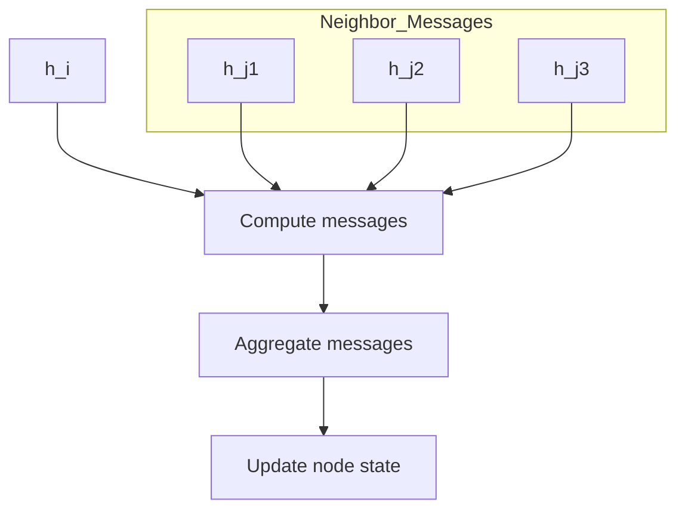
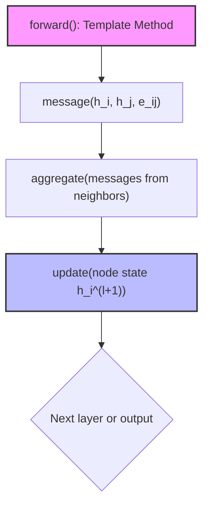
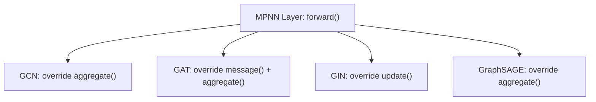
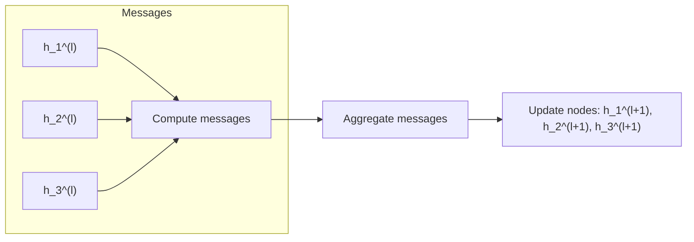

# GNN from Scratch with NumPy

**GCN · GAT · GIN · GraphSAGE · MPNN**

This project provides **clean, educational, NumPy-only implementations** of major **Graph Neural Network (GNN)** architectures, implemented **from scratch** to expose their mathematical foundations.

---

## Philosophy

The goal is **not performance**, but **understanding**:

- **NumPy only** — No PyTorch/PyG/DGL for modeling
- **Explicit matrix operations** — Every computation is visible
- **Manual backpropagation** — Gradients computed by hand
- **Theory–code alignment** — Mathematical equations map directly to implementation
- **Unified MPNN view** — All GNNs expressed through the same framework

This repository is designed for **learning, teaching, and self-study**. Each GNN is implemented as a specialization of the **Message Passing Neural Network (MPNN)** framework using the **Template Method design pattern**.

---

## Implemented Models

| Model | Description |
|-------|-------------|
| **GCN** | Graph Convolutional Network |
| **GAT** | Graph Attention Network |
| **GIN** | Graph Isomorphism Network |
| **GraphSAGE** | Sample & Aggregate |
| **MPNN** | Message Passing Neural Network (general framework) |

All models are trained and evaluated on **node classification tasks**.

---

## From MPNN Theory to Software Architecture

All modern GNNs can be expressed as instances of the **MPNN framework** (Gilmer et al., 2017). This unifying perspective reveals that different GNN architectures are simply different choices for three core operations.

### General MPNN Layer

For each node $i$ at layer $l$:

**1. Message** — Compute messages from neighbors
$$m_{ij}^{(l)} = M^{(l)}(h_i^{(l)}, h_j^{(l)}, e_{ij})$$

**2. Aggregation** — Combine neighbor messages
$$m_i^{(l)} = \bigoplus_{j \in \mathcal{N}(i)} m_{ij}^{(l)}$$

**3. Update** — Compute new node representation
$$h_i^{(l+1)} = U^{(l)}(h_i^{(l)}, m_i^{(l)})$$

Each GNN architecture defines its own:
- **Message function** $M$ — How to construct messages
- **Aggregation operator** $\bigoplus$ — How to combine messages  
- **Update function** $U$ — How to update node states



---

## Template Method Design Pattern

This project implements MPNN using the **Template Method pattern** — a behavioral design pattern where:

- A **base class** defines the skeleton of an algorithm (`forward()`)
- **Subclasses** override specific steps without changing the overall structure

### Why Template Method for MPNN?

The Template Method is the *correct* design pattern for MPNN because:

1. **Fixed execution pipeline** — Message → Aggregate → Update is always preserved
2. **Mathematical correctness** — The MPNN equations define a fixed structure
3. **Controlled extensibility** — New GNNs only override what's mathematically different
4. **Clean separation** — Base class handles orchestration; subclasses handle specialization

### MPNN → Template Method Mapping

| MPNN Concept | Design Pattern Role | Implementation |
|--------------|---------------------|----------------|
| **Message** | Hook method | `message(X, A)` |
| **Aggregate** | Hook method | `aggregate(messages, A)` |
| **Update** | Hook method | `update(aggregated)` |
| **Forward pass** | Template method | `forward(X, A)` — fixed in base class |
| **Backward pass** | Abstract method | `backward(error, lr)` — per-layer gradients |



### Base Class: `MPNNLayer`

The abstract base class in `core/MPNN_scratch/base.py` defines:

```
forward(X, A):
    messages = message(X, A)      # Hook: subclass defines
    aggregated = aggregate(messages, A)  # Hook: subclass defines
    output = update(aggregated)   # Hook: subclass defines
    return output
```

Each GNN layer inherits from `MPNNLayer` and overrides only the methods that differ mathematically.

---

## GNN → MPNN Specialization

Each implemented GNN is a **specialization** of the MPNN base layer, differing only in how `message()`, `aggregate()`, and `update()` are implemented.



### Complete Mapping Table

| Model | Message | Aggregate | Update | Specialization Focus | Reference |
|-------|---------|-----------|--------|---------------------|-----------|
| **GCN** | Identity | Normalized Laplacian $L \cdot X$ | Linear + activation | Aggregation-centric | [`docs/gcn.md`](docs/gcn.md) |
| **GAT** | Attention-weighted $\alpha_{ij} W h_j$ | Weighted sum via softmax | Linear + activation | Message + Aggregation | [`docs/gat.md`](docs/gat.md) |
| **GIN** | Identity | Sum (injective) $\sum_{j} h_j$ | MLP with $(1+\varepsilon)$ | Update-centric | [`docs/gin.md`](docs/gin.md) |
| **GraphSAGE** | Identity | Mean $D^{-1} A X$ | Concat + Linear + activation | Aggregation-centric | [`docs/GraphSAGE.md`](docs/GraphSAGE.md) |

---

## Detailed GNN Equations as MPNN

### GCN as MPNN

**Mathematical formulation:**
$$h_i^{(l+1)} = \sigma\left(\sum_{j \in \mathcal{N}(i) \cup \{i\}} \frac{1}{\sqrt{d_i d_j}} W h_j^{(l)}\right)$$

**MPNN decomposition:**
- **Message**: $m_{ij} = h_j$ (identity — features passed through)
- **Aggregate**: $m_i = L \cdot X$ where $L$ is the normalized graph Laplacian
- **Update**: $h_i^{(l+1)} = m_i \cdot W + b$

➡ GCN uses **fixed, non-learnable aggregation** based on graph structure.

---

### GAT as MPNN

**Mathematical formulation:**
$$h_i^{(l+1)} = \sigma\left(\sum_{j \in \mathcal{N}(i)} \alpha_{ij} W h_j^{(l)}\right)$$

where attention coefficients are:
$$\alpha_{ij} = \text{softmax}_j\left(\text{LeakyReLU}(a^T [Wh_i \| Wh_j])\right)$$

**MPNN decomposition:**
- **Message**: Compute attention scores $e_{ij}$ via learned attention mechanism
- **Aggregate**: Apply masked softmax and attention-weighted aggregation
- **Update**: $h_i^{(l+1)} = \sum_j \alpha_{ij} \cdot (W h_j) + b$

➡ GAT **learns edge importance dynamically** through attention.

---

### GIN as MPNN

**Mathematical formulation:**
$$h_i^{(l+1)} = \text{MLP}\left((1 + \varepsilon) \cdot h_i^{(l)} + \sum_{j \in \mathcal{N}(i)} h_j^{(l)}\right)$$

**MPNN decomposition:**
- **Message**: $m_{ij} = h_j$ (identity)
- **Aggregate**: $m_i = \sum_j h_j$ (sum — provably injective)
- **Update**: $h_i^{(l+1)} = \text{MLP}((1+\varepsilon) h_i + m_i)$

➡ GIN is **as powerful as the Weisfeiler–Lehman graph isomorphism test**.

---

### GraphSAGE as MPNN

**Mathematical formulation:**
$$h_i^{(l+1)} = \sigma\left(W \cdot \text{CONCAT}(h_i^{(l)}, \text{AGG}(\{h_j : j \in \mathcal{N}(i)\}))\right)$$

**MPNN decomposition:**
- **Message**: $m_{ij} = h_j$ (identity)
- **Aggregate**: $m_i = \frac{1}{|\mathcal{N}(i)|} \sum_j h_j$ (mean aggregation)
- **Update**: $h_i^{(l+1)} = \sigma(h_i \cdot W_{self} + m_i \cdot W_{neigh} + b)$

➡ GraphSAGE is **inductive** — can generalize to unseen nodes.

---

## Multi-Node Message Passing

The power of GNNs comes from simultaneous message passing across all nodes:



In matrix form, all node updates happen in parallel through matrix multiplications — this is why the NumPy implementations are vectorized.

---

## Design–Math Alignment

This implementation is **not a framework** — it mirrors the **mathematical definition directly**:

- Each GNN differs only in:
  - How messages are computed (`message()`)
  - How neighbors are aggregated (`aggregate()`)
  - How node states are updated (`update()`)

- The code structure follows **Gilmer et al. (2017)** exactly:
  - `forward()` implements the MPNN pipeline
  - Subclasses only override mathematically different components
  - Manual backpropagation ensures gradient correctness

This tight alignment between math and code makes the implementations ideal for:
- **Learning** — See exactly how equations become code
- **Teaching** — Use as lab exercises or lecture material
- **Research** — Modify components while preserving correctness

---

## Project Structure

```text
.
├── core/
│   ├── GCN_scratch/         # GCN layer + model
│   ├── GAT_scratch/         # GAT layer + model
│   ├── GIN_scratch/         # GIN layer + model
│   ├── GraphSAGE_scratch/   # GraphSAGE layer + model
│   ├── MPNN_scratch/        # Abstract MPNNLayer base class
│   ├── __init__.py          # Model registry
│   └── utils.py             # Activation functions, loss, etc.
├── data/                    # Graph datasets
├── docs/                    # Mathematical documentation
├── train.py                 # Training loop
├── pyproject.toml
└── README.md
```

---

## Documentation

| Document | Purpose |
|----------|---------|
| [`docs/mpnn.md`](docs/mpnn.md) | General MPNN theory |
| [`docs/gcn.md`](docs/gcn.md) | Exact GCN mathematical formulation |
| [`docs/gat.md`](docs/gat.md) | Exact GAT mathematical formulation |
| [`docs/gin.md`](docs/gin.md) | Exact GIN mathematical formulation |
| [`docs/GraphSAGE.md`](docs/GraphSAGE.md) | Exact GraphSAGE mathematical formulation |
| [`docs/wl.md`](docs/wl.md) | WL test & GIN expressiveness |

> **The README explains *how everything fits together*; the docs explain *the math in detail*.**

---

## Comparison Table

| Model | Message (M) | Aggregation | Update (U) | Learnable Aggregation | Attention | MLP | Inductive | Expressiveness |
|-------|-------------|-------------|------------|-----------------------|-----------|-----|-----------|----------------|
| **GCN** | $W h_j$ | Normalized sum | Linear + σ | ❌ | ❌ | ❌ | ❌ | Medium |
| **GAT** | $\alpha_{ij} W h_j$ | Weighted sum | Linear + σ | ✅ | ✅ | ❌ | ❌ | High |
| **GIN** | $h_j$ | **Sum** | **MLP** | ❌ | ❌ | ✅ | ❌ | **Very High** |
| **GraphSAGE** | $h_j$ | Mean / Max | Linear + σ | ❌ | ❌ | ❌ | ✅ | Medium |
| **MPNN** | Arbitrary | Any | Any | ✅ | Optional | Optional | Optional | Maximal |

---

## Usage

### 1. Clone the repository

```sh
git clone https://github.com/HamzaGbada/GCN-Numpy.git
cd GCN-Numpy
```

### 2. Install dependencies

```sh
uv sync
```

### 3. Activate the virtual environment

```sh
source .venv/bin/activate
```

### 4. Train a model

```sh
python train.py
```

To switch models, edit `train.py` and change `MODEL_NAME`:

```python
from core import get_model

MODEL_NAME = "GIN"  # Options: "GCN", "GAT", "GIN", "GraphSAGE"
model = get_model(MODEL_NAME, input_dim, hidden_dim, output_dim)
```

---

## Note on Data Loading

We use **[PyTorch Geometric](https://pytorch-geometric.readthedocs.io/en/latest/)** **only for data loading**, not for modeling.

Datasets used:
- **[Zachary's Karate Club](http://vlado.fmf.uni-lj.si/pub/networks/data/ucinet/ucidata.htm#zachary)**
- **Cora** (citation network)

All **GNN models and training logic** are implemented **purely in NumPy**.

---

## References

- **Gilmer et al. (2017)** — Neural Message Passing for Quantum Chemistry (MPNN framework)
- **Kipf & Welling (2017)** — Semi-Supervised Classification with Graph Convolutional Networks
- **Veličković et al. (2018)** — Graph Attention Networks
- **Xu et al. (2019)** — How Powerful are Graph Neural Networks? (GIN)
- **Hamilton et al. (2017)** — Inductive Representation Learning on Large Graphs (GraphSAGE)
- **Weisfeiler & Lehman (1968)** — The reduction of a graph to canonical form

---

## License

MIT License
